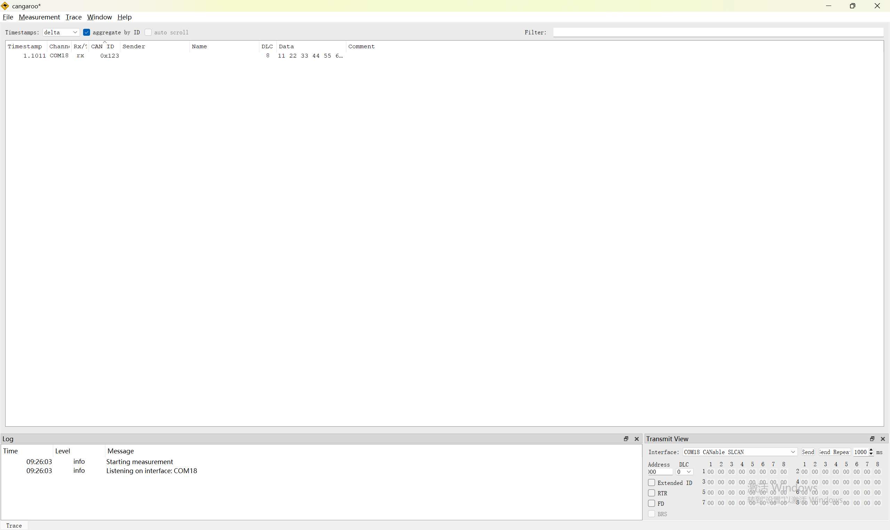
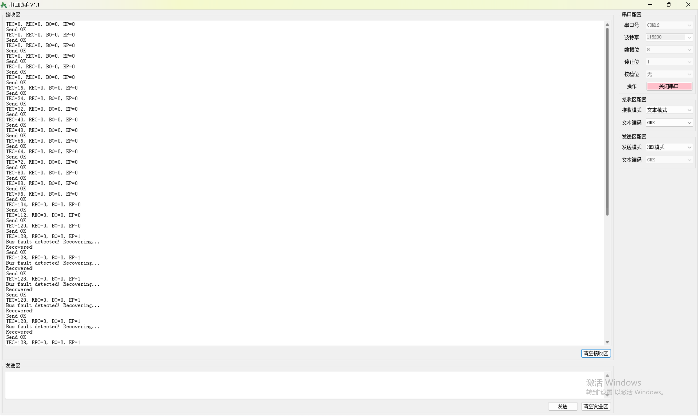
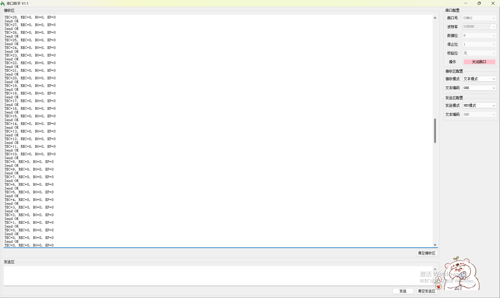
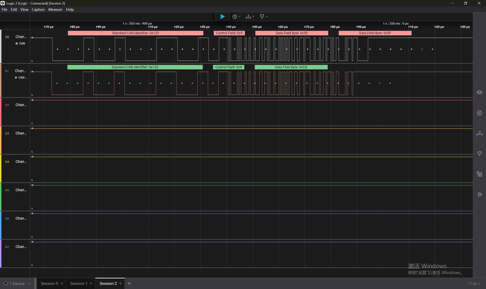

# STM32H743 FDCAN BusOff 自愈实验

## 实验目的
验证 STM32H743 的 FDCAN 外设在总线故障（无 ACK）时进入 Error Passive，并实现自动恢复。实验覆盖**经典 CAN 2.0**与 **CAN FD** 两种模式。

## 硬件架构
- **MCU**：STM32H743VIT6 + TJA1044GT
- **对端**：CANable + Cangaroo
- **总线**：
  - 仲裁段：250kbps，采样点 87.5%
  - 数据段（CAN FD）：2Mbps，采样点 80%，开启 BRS
- **调试工具**：Saleae Logic 2 逻辑分析仪

## 经典 CAN 2.0 模式实验

### 实验步骤
1. H7 周期发送 0x123，CANable 监听并 ACK
2. 拔掉 CANable，制造总线无应答故障
3. H7 的 TEC 累积至 128，进入 Error Passive（EP=1）
4. 检测到 EP=1，主动复位 CAN 控制器
5. 重新插上 CANable，通信恢复

### 实验现象
- 正常通信：`TEC=0, REC=0, BO=0, EP=0`，串口打印 `Send OK`
- 故障发生：`TEC=128, REC=0, BO=0, EP=1`，触发 `Bus fault detected! Recovering...`
- 恢复后：`TEC` 递减至 0，通信恢复
- 截图见 `docs/classic_can/`（可自行上传，或参考 CAN FD 部分验证思路）

## CAN FD 模式扩展实验

### 实验条件
将 FDCAN1 切换为 FD 模式（`FDCAN_FRAME_FD_BRS`），仲裁段 250kbps，数据段 2Mbps，开启 BRS。对端使用支持 CAN FD 的 CANable 进行通信与抓包。

### 关键配置
- **H7 端**：`DataPrescaler=3, DataTimeSeg1=7, DataTimeSeg2=2`（60MHz 时钟下计算出 2Mbps，采样点 80%）
- **CANable 端**：Cangaroo 配置 `CANFD Bitrate=2000000`，`SamplePoint=80%`
- **踩坑**：Cangaroo 的 CANFD Bitrate 只提供 2M 与 5M 选项，需将 MCU 数据段从 1M 调整至 2M 才能正常通信。

### 实验现象（证据链）

1. **正常通信**
   
   *Cangaroo 成功接收 0x123 的 FD 帧，DLC=8，数据为 11 22 33 44 55 66 77 88。*

2. **故障触发**
   
   *拔掉 CANable 后，TEC 累积至 128 进入 Error Passive（EP=1），自愈逻辑打印 `Bus fault detected! Recovering...` 并主动复位控制器。*

3. **通信恢复**
   
   *重新插上 CANable 后，TEC 由 28 逐步递减至 0，通信彻底恢复，持续打印 `Send OK`。*

4. **物理层波形**
   
   *Saleae 解码出 CAN FD 帧结构。尾部红色叉为 2Mbps 高速率下解码器的采样点判定误差，不影响实际收包。*

## 结论
FDCAN 在 Error Passive 状态下 TEC 会被硬件冻结，无法达到 BusOff。因此自愈逻辑不能依赖 BusOff 回调，必须在检测到 EP=1 时主动复位 CAN 控制器。

在 CAN FD 模式下，TEC 累积速度更快（可达 128 甚至 248），但检测 `EP==1` 即主动复位自愈的策略在两种模式下**均能生效**。

## 关键代码
- `can_app.c`：错误检测 + 主动恢复
- `bsp_can.c`：FDCAN 过滤器、接收中断、发送函数

## 踩坑记录
1. FDCAN 时钟源被 CubeMX 覆盖：必须在 `SystemClock_Config()` 末尾手动强制切换到 PLL1Q。
2. FDCAN 在 Error Passive 下 TEC 冻结：自愈逻辑不能等待 BusOff 回调，必须在检测到 EP=1 时主动复位 CAN 控制器。
3. CANable 波特率每次打开会重置：每次插拔后需重新确认 Cangaroo 的数据段波特率和采样点。
4. CAN FD 数据段波特率必须严格匹配：MCU 配置 2Mbps（`DataPrescaler=3, DataTimeSeg1=7, DataTimeSeg2=2`），Cangaroo 选 2000000 与 80% 采样点。
5. 逻辑分析仪帧尾报错（红色 x）：在 2Mbps 高速数据段下，普通逻辑分析仪采样点边界判定有误差，但不影响实际通信，只要 Cangaroo 能收到帧即可。

---------------------------------------------------------------------------------------------------------------------------------------
##验证CANFD跟CAN2.0的兼容性

## 实验一：FDCAN BusOff 自愈机制

### 实验目的
验证 H7 在总线故障（无 ACK）时进入 Error Passive，并实现自动恢复。

### 实验步骤
1. H7 周期发送 0x123，CANable 监听并 ACK
2. 拔掉 CANable，制造总线无应答故障
3. H7 的 TEC 迅速累积，进入 Error Passive（EP=1）
4. 检测到 EP=1，主动复位 CAN 控制器
5. 重新插上 CANable，通信恢复

### 实验现象
- 正常通信：`TEC=0, REC=0, BO=0, EP=0`，串口打印 `Send OK`
- 故障发生：`TEC=128, EP=1`，触发 `Bus fault detected! Recovering...`
- 恢复后：`TEC` 递减至 0，通信恢复

### 结论
FDCAN 在 Error Passive 状态下 TEC 会被硬件冻结，无法达到 BusOff。因此自愈逻辑不能依赖 BusOff 回调，必须在检测到 EP=1 时主动复位 CAN 控制器。该策略在经典 CAN 和 CAN FD 模式下均验证有效。

---

## 实验二：CAN FD 与经典 CAN 兼容性验证

### 2.1 经典 CAN → CAN FD（向下兼容）

- **配置**：F4 发经典帧（ID=0x456，DLC=8，250kbps），H7 配 FD 模式（`FDCAN_FRAME_FD_BRS`）接收。
- **现象**：F4 打印 `F4 Send OK`，H7 打印 `H7 Recv! ID:0x456, Data: AA BB CC DD EE FF 11 22`。
- **逻辑分析仪**：正确解码出 0x456 的经典 CAN 帧，数据场完整，CRC 校验正确。
- **结论**：CAN FD 控制器（H7）向下兼容经典 CAN 帧。

### 2.2 CAN FD → 经典 CAN（不兼容）

- **配置**：H7 发 FD 帧（ID=0x333，64字节，BRS关），F4 经典节点接收。
- **现象**：
  - F4 硬件无法解析 FDF=1 的帧，在总线中途主动插入错误帧（逻辑分析仪抓到 0x333 后的 Error）。
  - F4 接收错误计数器（REC）迅速飙升至 255，进入 Error Passive（EP=1）。
  - F4 的持续报错干扰了总线，导致 H7 发送 FIFO 塞满，串口从 `H7 Send FD OK` 退化为 `H7 Send FD FAILED`。
- **结论**：经典 CAN 节点无法解析 FD 帧，且会主动用错误帧破坏总线，导致 FD 节点通信阻塞。混合组网必须通过网关做协议转换。

---

## 关键代码
- `can_app.c`：错误检测 + 主动恢复逻辑
- `bsp_can.c`：FDCAN 过滤器、接收中断、发送函数
- `H7_FDCAN_Compatibility/`：包含 F4（经典 CAN 节点）和 H7（FD 节点）两侧的兼容性测试工程

